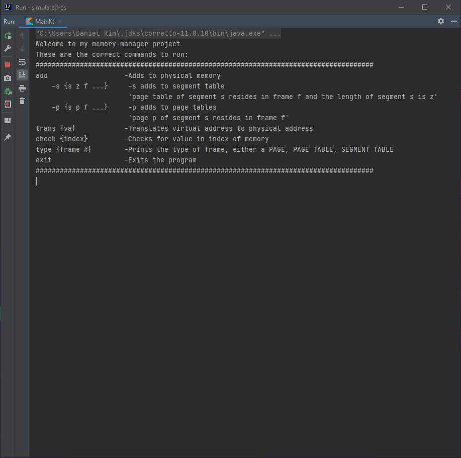
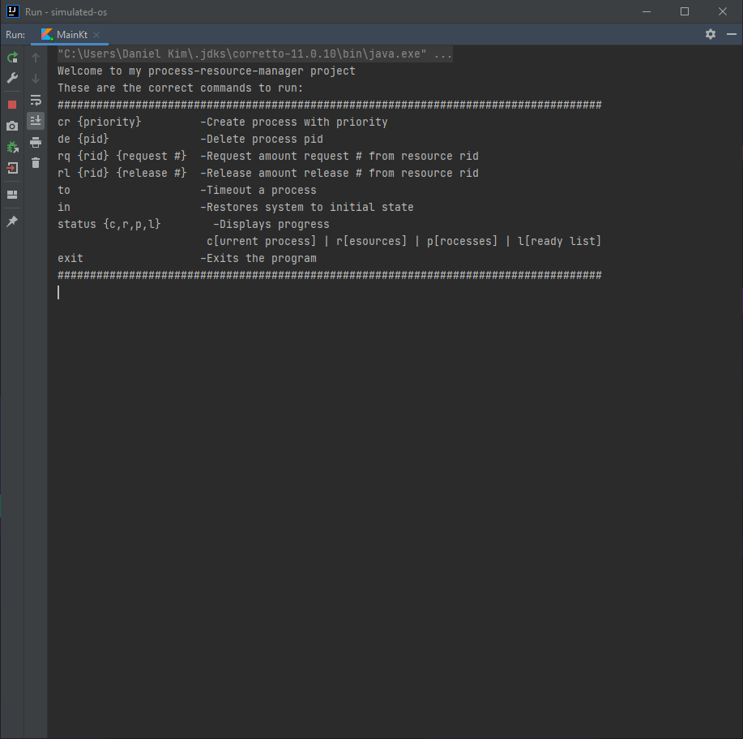

Simulated OS
============

The project is divided into two separate modules:
* `memory-manager`
* `process-resource-manager`

Each module is run separately and contain a designated `Main.kt` file.

## Development

* Written in Kotlin

## Screenshots

#### `memory-manager` `Main.kt`

#### `process-resource-manager` `Main.kt`

